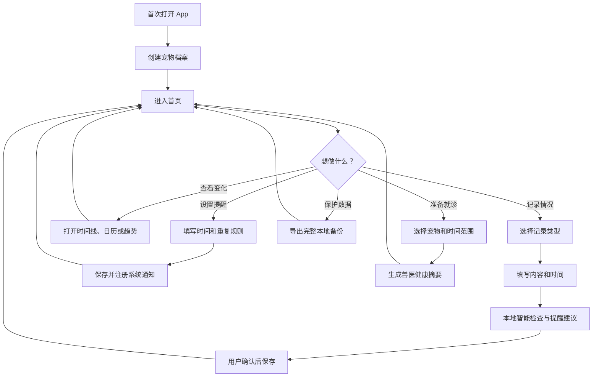
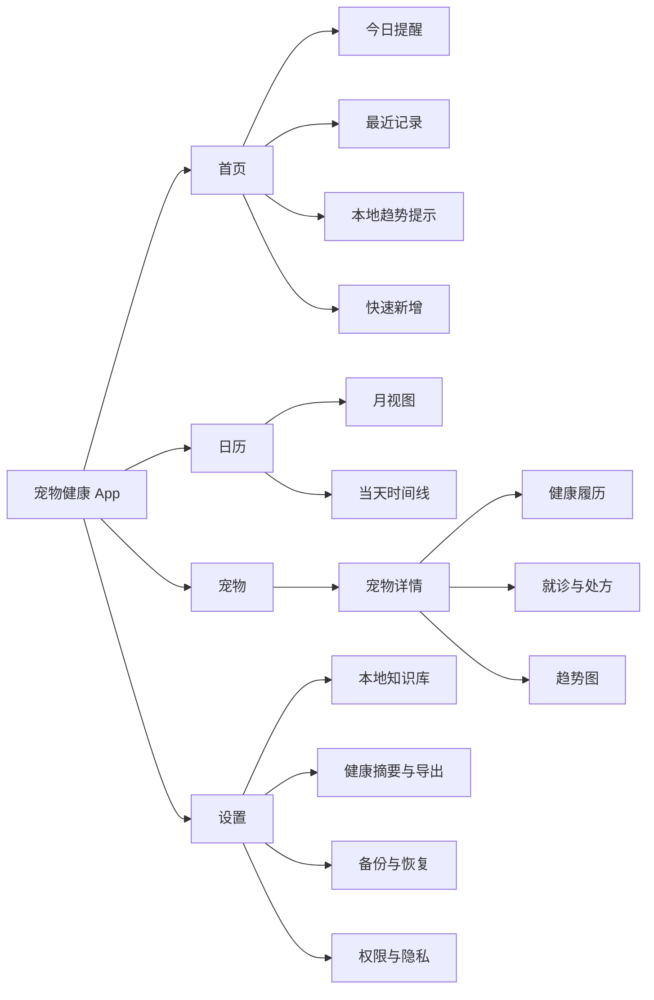
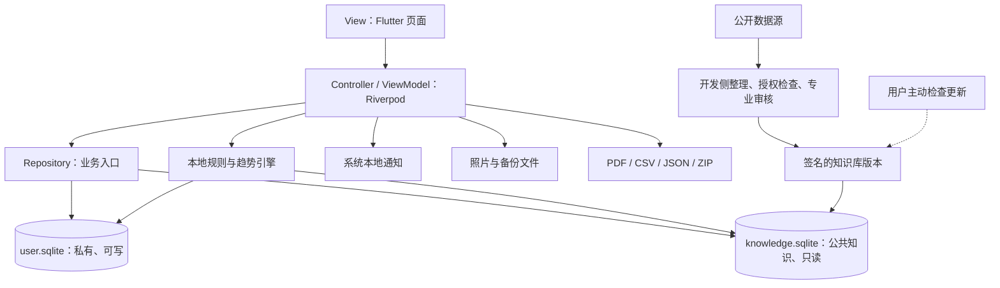
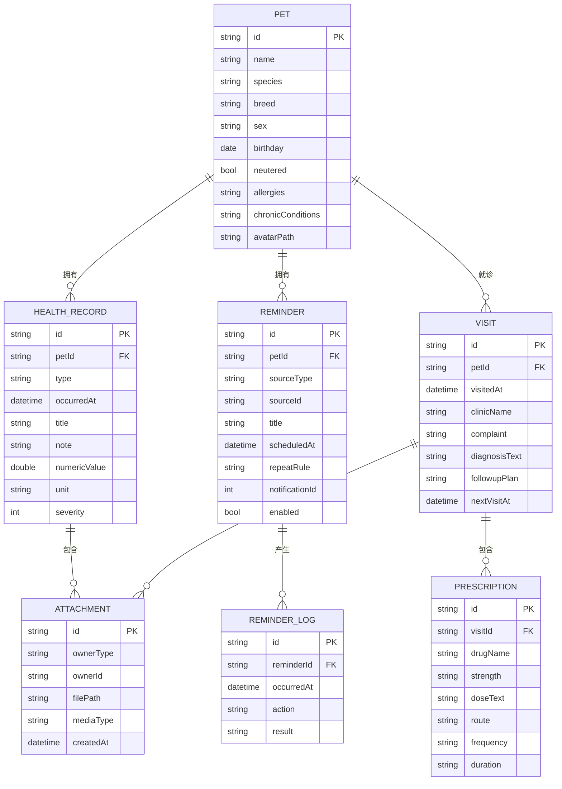
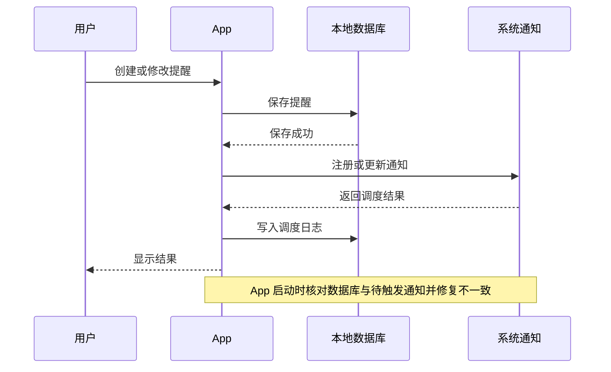

# 毛健康：宠物健康记录 App 项目蓝图

> 版本：0.3  
> 更新日期：2026-06-22  
> 状态：讨论稿

这份文件是我们共同维护的产品与技术地图。它描述软件要解决的问题、功能范围、数据结构、智能能力和开发顺序。讨论确认后的决定统一更新在这里。

## 1. 产品定位

产品定位为：**宠物健康履历 + 高可靠提醒 + 本地智能辅助 + 兽医协作导出**。

它完成的闭环是：

```text
观察 → 记录 → 提醒 → 趋势提示 → 回顾 → 整理就诊资料
```

产品帮助主人持续记录、按时处理事项并看懂变化，但不代替兽医诊断或开具治疗方案。

### 核心目标

- 建立一只或多只宠物的长期健康档案
- 记录体重、饮食、排泄、症状、用药、疫苗、驱虫和就诊信息
- 设置单次或重复提醒，并追踪完成、跳过和失败情况
- 在设备本地发现值得关注的趋势，给出可解释提示
- 生成兽医容易阅读的健康摘要
- 完整导出和恢复数据，包括照片附件

### 优先服务的人群

1. 新手主人：容易遗漏疫苗、驱虫、绝育和体检计划。
2. 慢病或术后宠物主人：需要连续记录体重、食欲、饮水、排泄、用药和复诊。
3. 多宠物家庭：需要快速区分每只宠物的记录与提醒。

### 第一版不做

- AI 自动诊断或疾病概率预测
- 自动计算、推荐或修改处方药剂量
- 把用户健康记录上传到第三方数据库
- 未经专业审核的急症判断和疾病知识

## 2. 用户使用流程



## 3. 页面与功能地图



底部导航暂定为：`首页｜日历｜宠物｜设置`。新增记录使用全局“＋”按钮。

## 4. 总体软件架构

采用 Flutter、Material 3 和功能模块化 MVVM。用户数据与公共知识数据分开保存。



### 两个数据库的边界

| 数据库 | 内容 | 特性 |
|---|---|---|
| `user.sqlite` | 宠物、记录、就诊、处方原文、提醒、提醒日志 | 私有、可写、可备份、可彻底删除 |
| `knowledge.sqlite` | 知识卡片、同义词、药品基础信息、规则、证据来源 | 只读、带版本、可替换、可回滚 |

知识库不能覆盖用户录入的兽医医嘱。完整备份只包含用户数据和附件，不需要重复打包公共知识库。

## 5. 本地智能功能

首版智能能力优先采用确定性规则、统计和模板，不依赖大语言模型。

| 能力 | 实现方式 | 阶段 |
|---|---|---|
| 智能提醒建议 | 根据记录类型、已有计划和用户历史提出提醒，由用户确认 | P0 |
| 趋势提示 | 与宠物自身历史基线比较，提示持续或明显变化 | P0 |
| 自动健康摘要 | 模板整理近期记录、用药、就诊、提醒完成情况 | P0 |
| 本地知识搜索 | SQLite FTS5 搜索知识卡片、药品名和同义词 | P0 |
| 处方与检查单 OCR | 端侧识别文字，用户逐项确认后入库 | P1 |
| 审核后的红旗卡片 | 只给行动级别和就医准备，不给疾病概率 | P1 |
| 本地自然语言查询 | 在自己的记录中查询和汇总，不回答诊断问题 | P2 |
| 图片疾病诊断 | 风险高且难验证 | 不实现 |

### 趋势提示原则

- 优先比较同一只宠物自己的历史，而不是套用通用正常值。
- 数据不足时只提示继续记录，不生成结论。
- 明确说明触发原因、使用了哪些记录以及时间范围。
- 阈值必须可配置、可测试，并经过专业审核后才能用于健康行动提示。
- 用户可以忽略提示或标记记录有误。

### OCR 流程


OCR 只减少输入工作量，识别结果不能未经确认直接创建用药提醒。

## 6. 可解释规则引擎

规则输出固定为提示和行动建议，不输出诊断名称或疾病概率。

```text
Rule
├── id / version / status
├── 适用物种、年龄和条件
├── 必需输入字段
├── all / any 条件组合
├── 提示等级：info / attention / urgent
├── 展示文本和触发原因
├── 建议行动
├── evidenceIds
├── reviewedBy / reviewedAt
└── expiresAt
```

规则能力分阶段实现：

| 层级 | 示例 | 计划 |
|---|---|---|
| 时间驱动 | 用药、疫苗、驱虫、复诊到期 | P0 |
| 事件驱动 | 新增就诊后建议创建复诊提醒 | P0 |
| 趋势驱动 | 一段时间内体重或食欲偏离自身基线 | P0，先做低风险提示 |
| 红旗规则 | 确定性症状组合对应就医行动 | P1，必须专业审核 |
| 风险评分 | 综合症状、病史、年龄和趋势 | 暂不实现 |

每次规则结果保存 `ruleId + ruleVersion + inputSnapshot + occurredAt`，方便解释、测试和追溯。

## 7. 公开数据源策略

公开数据不能未经整理直接成为医疗判断依据。标准流程是：

```text
下载 → 校验授权 → 保留原始快照 → 结构化 → 去重/翻译 → 专业审核 → 测试 → 发布知识包
```

| 数据源 | 可辅助的内容 | 重要限制 |
|---|---|---|
| [FDA Green Book](https://www.fda.gov/animal-veterinary/products/approved-animal-drug-products-green-book) | 美国获批动物药品的商品名、活性成分和申请信息 | 代表美国监管状态，不能代替中国批准信息或兽医医嘱 |
| [DailyMed](https://dailymed.nlm.nih.gov/dailymed/) | 人用与动物用药品标签、成分、警告和不良反应原文 | 不是所有受监管产品的完整清单；标签需区分物种和地区 |
| [openFDA 动物不良事件](https://open.fda.gov/apis/animalandveterinary/event/) | 公开不良事件报告的检索与研究 | 存在延迟、缺失和报告偏差；官方明确不应据此作医疗决策 |
| [openFDA 食品召回](https://open.fda.gov/apis/food/enforcement/) | 美国食品及部分宠物食品召回信息 | 不是宠物食品专库，不覆盖中国市场，需要分类和人工校验 |
| 兽医协会、大学兽医中心资料 | 疾病观察、护理和就医指引的审核依据 | 多数不是结构化 API，复制、翻译和再发布前必须确认授权 |

国内兽药网站在没有确认稳定、正式的公开 API 和再使用许可前，不采用网页抓取。可以先维护少量人工审核的国内药品同义词和来源链接。

### 严格离线与可选联网

推荐先实现严格离线模式：公开资料由开发侧整理进 `knowledge.sqlite`，随 App 版本发布。

以后如果增加联网，只提供用户主动触发的知识包更新：

- 不上传宠物档案和健康记录。
- 下载经过审核和签名的完整知识包，不让客户端直接拼接原始 API 结论。
- 显示知识版本、适用地区、更新时间和变更说明。
- 下载失败不影响任何记录、提醒和搜索功能。

## 8. 核心数据关系



照片本体保存在 App 文件目录，数据库只保存路径。处方字段保存实际医嘱，不由 App 自动推算。

### 知识库核心表

| 表 | 用途 |
|---|---|
| `knowledge_articles` | 标题、正文、适用物种、地区和审核状态 |
| `knowledge_sources` | 原始来源、许可、发布日期和抓取时间 |
| `knowledge_synonyms` | 药名、商品名、常见别名和搜索词 |
| `rules` | 版本化条件、提示和行动建议 |
| `rule_evidence` | 规则与来源之间的对应关系 |
| `knowledge_versions` | 知识包版本、校验值、发布时间和兼容版本 |

## 9. 第一版记录类型

| 类型 | 建议填写内容 | 是否可以设置提醒 |
|---|---|---|
| 体重 | 数值、单位、备注 | 否 |
| 饮食/饮水 | 食物、份量、评分、备注 | 可选 |
| 排尿/排便 | 状态、次数、备注、照片 | 否 |
| 症状 | 症状、严重程度、持续时间、备注、照片 | 可选 |
| 用药 | 药名、剂型、医嘱原文、给药方式、完成情况 | 是 |
| 疫苗 | 疫苗名称、接种日期、医院、批号、不良反应 | 是 |
| 驱虫 | 药品、体内/体外、规格、给药日期 | 是 |
| 就诊/复诊 | 医院、主诉、检查、诊断原文、复诊计划 | 是 |
| 洗澡护理 | 项目、备注 | 可选 |
| 自定义 | 标题、内容 | 可选 |

## 10. 提醒可靠性

数据库中的提醒是唯一真实来源，系统通知只是执行方式。



验收要求：

- 修改、禁用或删除提醒后，旧通知不会继续触发。
- 手机重启、App 升级及时区变化后能够恢复正确计划。
- 通知权限被拒绝时，记录仍能保存，并说明如何恢复权限。
- 完成、跳过、稍后提醒和调度失败能够在日志中区分。
- 提醒失败不能影响健康记录本身的保存。

## 11. 技术选择与目录

| 领域 | 暂定方案 |
|---|---|
| 双端框架 | Flutter |
| 视觉系统 | Material 3 |
| 状态管理与依赖注入 | Riverpod |
| 路由 | go_router |
| 用户数据库 | Drift + SQLite |
| 知识库搜索 | SQLite FTS5 |
| 本地提醒 | flutter_local_notifications |
| 时区 | timezone + flutter_timezone |
| 图片与文件 | image_picker + path_provider |
| 端侧 OCR | ML Kit Text Recognition，经 Flutter 平台封装 |
| 自定义端侧模型 | 暂不使用；以后按验证结果评估 LiteRT |
| 健康摘要 | 本地生成 PDF |
| 完整备份 | JSON 清单 + 附件，打包为 ZIP |

```text
lib/
├── app/                    # App、路由、主题
├── core/
│   ├── database/           # user.sqlite
│   ├── knowledge/          # knowledge.sqlite、搜索和版本
│   ├── intelligence/       # 规则、趋势、解释结果
│   ├── notifications/
│   ├── files/
│   ├── export/
│   └── widgets/
├── features/
│   ├── home/
│   ├── pets/
│   ├── records/
│   ├── reminders/
│   ├── visits/
│   ├── calendar/
│   ├── insights/
│   ├── reports/
│   └── settings/
└── main.dart

tools/
└── knowledge_pipeline/     # 开发侧下载、转换、审核和打包工具
```

## 12. 功能优先级

| 优先级 | 范围 |
|---|---|
| P0 | 多宠物档案、结构化记录、就诊与处方原文、提醒与日志、时间线、日历、照片、本地搜索、低风险趋势提示、自动摘要、完整备份恢复 |
| P1 | OCR、体重等趋势图、慢病/术后模板、专业审核的红旗卡片、签名知识包更新、应用锁和加密备份 |
| P2 | 本地自然语言查询、家庭共享、云同步、硬件接入、在线咨询和经过验证的复杂规则 |

首版验收重点是：记录结构清楚、提醒可靠、提示可解释、导出可读、备份可恢复。

## 13. 开发阶段

### 阶段 1：可运行骨架

- [x] 创建 Flutter 工程和 Material 3 主题
- [x] 配置 Riverpod、路由和四个底部页面
- [ ] 建立 `user.sqlite`、迁移机制和测试数据库
- [ ] 建立空的 `knowledge.sqlite`、版本表和 Repository 接口

### 阶段 2：宠物、记录与就诊

- [ ] 完成宠物档案、健康记录和照片附件
- [ ] 完成就诊、处方原文和复诊计划
- [ ] 完成首页、时间线和筛选

### 阶段 3：高可靠提醒

- [ ] 创建单次与重复提醒
- [ ] 实现完成、跳过、稍后提醒、修改和删除
- [ ] 写入提醒日志并实现启动时一致性修复
- [ ] 测试重启、升级、权限、时区和跨日场景

### 阶段 4：第一批本地智能

- [ ] 实现提醒建议和用户确认流程
- [ ] 实现基于自身历史的低风险趋势提示
- [ ] 实现模板化健康摘要
- [ ] 建立 FTS5 本地知识搜索
- [ ] 建立规则解释、版本和测试框架

### 阶段 5：知识库与导出

- [ ] 建立开发侧知识整理流水线
- [ ] 完成来源、授权、审核和知识版本记录
- [ ] 生成兽医 PDF 摘要和 CSV/JSON 导出
- [ ] 完成包含附件的 ZIP 备份与完整恢复

### 阶段 6：增强与发布

- [ ] 实现 OCR，并要求用户确认所有候选字段
- [ ] 完成单元、组件、集成和双端真机测试
- [ ] 检查无障碍、深色模式、权限和隐私说明
- [ ] 准备 App Store 与 Android 发布材料

## 14. 医疗、智能与隐私边界

1. App 记录事实和医嘱，不自行诊断疾病。
2. 不自动计算剂量，不给出补服、停药或换药方案。
3. 智能输出必须显示原因、使用的数据、规则版本和建议行动。
4. 医疗知识必须记录来源、许可、审核人、版本和更新时间。
5. 原始公开数据不能直接变成用户行动建议。
6. 用户数据默认完全离线，不引入广告和非必要分析 SDK。
7. 只申请通知、相机、相册和文件等当前功能必需权限。
8. 用户能够导出全部数据，也能删除单条记录、单只宠物或全部数据。
9. 知识包更新不得上传宠物档案或健康记录。
10. 所有规则和数据库结构变更必须有迁移与回归测试。

## 15. 首版质量指标

| 领域 | 验收方式 |
|---|---|
| 离线能力 | 飞行模式下所有 P0 功能可用 |
| 提醒可靠性 | 覆盖新增、修改、删除、重启、升级、时区和权限测试矩阵 |
| 智能可解释性 | 每条提示可查看触发记录、原因和规则版本 |
| 数据不足处理 | 样本不足时不输出健康结论 |
| OCR 安全性 | 未经用户确认的识别结果不能创建记录或提醒 |
| 备份恢复 | 全新环境执行导出→清空→恢复，记录和附件一致 |
| 知识追溯 | 每条知识和规则能够追溯到来源及审核状态 |
| 双端体验 | iOS、Android 的主要流程、深色模式和大字体均可完成 |

## 16. 待讨论事项

- [x] App 名称确定为“毛健康”，寓意毛孩子健康。
- [ ] 第一版只服务猫狗，还是允许任意宠物种类？
- [ ] 首页更强调今日提醒、最近状态还是趋势提示？
- [ ] 第一批趋势只做体重，还是同时加入食欲、饮水和排泄？
- [ ] 首版知识库只收录哪些主题？
- [ ] 谁负责审核医疗知识和红旗规则？
- [ ] 是否接受未来提供“用户主动检查知识更新”的轻量联网功能？
- [ ] 首版健康摘要只做表格，还是加入体重折线图？
- [ ] 重复提醒需要支持每天、每周、每月和哪些自定义规则？
- [ ] 首版是否需要应用锁或加密备份？

## 17. 变更记录

| 日期 | 版本 | 内容 |
|---|---|---|
| 2026-06-22 | 0.3 | 整合本地智能、双数据库、规则引擎、公开数据源、OCR、知识流水线和安全边界 |
| 2026-06-22 | 0.2 | 强化产品定位、就诊/处方模型、提醒日志、兽医摘要和质量指标 |
| 2026-06-21 | 0.1 | 创建产品目标、页面、架构、数据关系和开发阶段初稿 |
