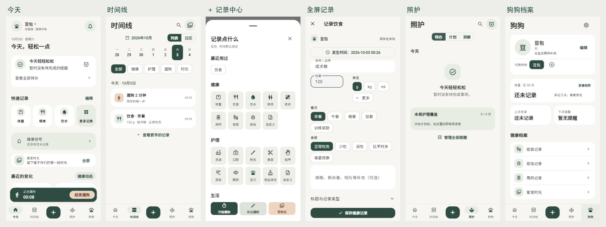

# 毛健康

离线优先的狗狗健康与护理记录应用，使用 Flutter 开发。支持多狗档案、健康与护理记录、提醒、遛狗计时和爱宠时光，用户数据保存在设备本地。

## 当前功能

| 入口 | 功能 |
| --- | --- |
| 今天 | 今日待办、快捷记录、健康信号、最近一条时光 |
| 时间线 | 健康、护理、遛狗、时光混排，按日期与分类回看，支持列表 / 日历切换 |
| ＋ | 统一记录中心，选择类型后进入全屏表单 |
| 照护 | 待办、护理计划、完成统计和健康动态 |
| 狗狗 | 多狗档案与切换、近 90 天体重趋势、健康记录入口；右上角进入设置 |

- **健康记录**：体重、饮食、饮水、排泄、症状、用药、疫苗、驱虫、自定义。
- **护理记录**：洗澡、遛狗、口腔、梳毛、美容、指甲、耳部、眼部、足爪、用品环境、自定义。
- **记录交互**：全屏编辑、时间调整、类型与关键词筛选、编辑和删除；普通新增记录保存后提供五秒撤销。
- **遛狗**：开始即保存，重启可恢复，计时条在四个主页面间可用；结束后可补充地点。
- **提醒与计划**：单次 / 重复提醒、完成 / 跳过 / 稍后、完成后记录模板、护理计划及执行日志。
- **爱宠时光**：随笔、心情、照片或视频相册引用；保留独立入口，删除时光不删除相册原件。
- **本地参考**：确定性健康统计与摘要，知识库分类、关键词搜索和相关文章。

核心记录与统计不依赖账号或云端。健康提示用于观察和回顾，不提供诊断、处方或药物剂量。

### 界面预览



截图来自独立演示档案。布局与交互说明见 [UI 说明](docs/UI_REFACTOR.md)。

## 开始开发

需要 Flutter SDK，Dart 版本满足 `pubspec.yaml` 中的 `^3.12.2`。移动端开发另需 Xcode / CocoaPods 或 Android SDK。

```bash
git clone https://github.com/Q-LL/pet-health.git
cd pet-health
flutter pub get
flutter run -d chrome
```

连接手机或启动模拟器后，可用 `flutter devices` 查找设备，再运行：

```bash
flutter run -d <device-id>
```

修改 Drift 表结构后重新生成代码：

```bash
dart run build_runner build --delete-conflicting-outputs
```

Web 数据保存在当前浏览器中，与手机数据库独立。爱宠时光的系统相册引用仅在 iOS / Android 实现；Web 不调度系统通知，也不支持 Live Activity。

当前 iOS Runner 与 Live Activity 扩展的部署目标为 **iOS 26.0**，构建前请在 Xcode 核对目标系统和签名。仓库没有完整的桌面发行工程。

## 技术与目录

Flutter / Material 3、Riverpod、go_router、Drift / SQLite。四个保留状态的页面分支组成五格底栏，中心 ＋ 为操作入口。

```text
lib/
├── app/                # 启动、路由、底栏与主题
├── core/
│   ├── database/       # 用户数据库与迁移
│   ├── knowledge/      # 内置知识数据库
│   ├── files/          # 照片、相册引用与视频服务
│   ├── notifications/  # 本地通知、iOS Live Activity
│   └── ui/             # 共享组件、token 和动效
└── features/           # 狗狗、记录、照护、提醒、时间线等业务模块
assets/                 # 应用图标与实际使用的插画
test/                   # 数据、规则、迁移和页面回归测试
docs/                   # 当前架构、接口、开发状态和 UI 说明
android/、ios/、web/     # 平台工程与 Web 数据库运行资源
```

用户数据库 schema v8，知识数据库 schema v2，两者分别保存。页面通过 Repository / Provider 使用数据；详细接口约定见 [本地数据接口](docs/LOCAL_DATA_API.md)。

## 检查与构建

```bash
flutter analyze --no-pub
flutter test --no-pub
flutter build web --no-pub --release
```

先执行 `flutter pub get`。数据层和主要页面测试使用内存数据库；原生相册授权、系统通知、后台恢复和 Live Activity 需单独在设备上验收。

## 文档

| 文档 | 用途 |
| --- | --- |
| [产品与架构](docs/ARCHITECTURE.md) | 当前模块、数据库、媒体及平台边界 |
| [本地数据接口](docs/LOCAL_DATA_API.md) | Repository、Provider、类型、时间与错误约定 |
| [开发状态](docs/DEVELOPMENT_PLAN.md) | 已实现内容、待验收项目和后续开发顺序 |
| [UI 说明](docs/UI_REFACTOR.md) | 当前页面层级、路由、记录与遛狗交互、实际截图 |

## 尚未实现

就诊与处方专用数据层、通用附件关联、PDF / CSV / JSON 导出、完整备份恢复、OCR、GPS 路线和知识包更新尚未实现。设置页没有可用的导出或备份入口；相关开发项见 [开发状态](docs/DEVELOPMENT_PLAN.md)。
