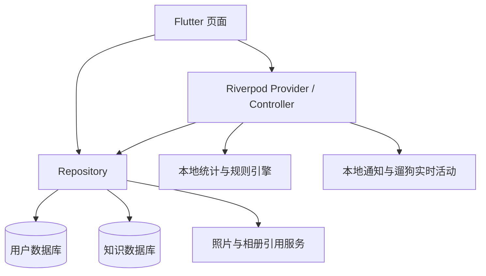

# 产品与架构

更新：2026-10-03。本文描述当前实现；后续工作见 [开发状态](DEVELOPMENT_PLAN.md)，页面细节见 [UI 说明](UI_REFACTOR.md)。

## 产品范围

毛健康是一款离线优先的狗狗健康与护理记录应用。核心流程是创建档案、记录日常情况、处理提醒与护理计划、回看记录和变化。支持多只狗狗，每只狗狗的记录、提醒、计划和时光分别保存。

当前本地规则提供记录统计、护理候选计划和健康摘要。它们辅助观察与回顾，不提供诊断、处方或药物剂量；没有大模型服务或云端用户数据库。

## 页面组织

底栏为 `今天｜时间线｜＋｜照护｜狗狗`。`StatefulShellRoute.indexedStack` 保留四个页面分支；中心 ＋ 打开记录中心。

| 入口 | 当前内容 |
| --- | --- |
| `/today` | 当前狗狗、今日任务、快捷记录、健康信号和最近一条时光 |
| `/timeline` | 健康、护理、遛狗、时光混排；日期、类型、列表 / 日历切换 |
| `/care` | 待办、计划、洞察，使用 `seg` 参数选择分区 |
| `/pet` | 当前档案、狗狗切换、体重趋势、健康档案与设置入口 |
| 二级入口 | `/records`、`/memories`、`/reminders`、`/inbox`、`/settings`、`/knowledge`、`/care/coverage`、`/care/dynamics` |

二级页面与记录表单位于根 Navigator，隐藏底栏。旧 `/home`、`/calendar`、`/pets` 等入口通过 `legacyRedirect` 兼容。查询参数、返回规则与具体交互以 [UI 说明](UI_REFACTOR.md) 为准。

## 代码分层

- `lib/app`：启动、路由、底栏、主题和中文本地化。
- `lib/core/ui`：颜色与间距 token、页面容器、卡片、选项组、状态视图和动效。
- `lib/core/database`：用户数据库 schema、索引和迁移。
- `lib/core/knowledge`：独立知识库 schema 与内置条目。
- `lib/core/files`：照片存储、相册引用和视频播放，通过条件导入隔离平台实现。
- `lib/core/notifications`：通知调度及 iOS Live Activity 桥接。
- `lib/features`：按业务划分 `presentation`、`application`、`data`、`domain`；简单模块不强制包含全部层级。

页面通过 Repository 或 Provider 使用数据，不直接写 Drift 表。Repository 负责业务校验、数据库操作和实体映射；Controller 组合记录、计划日志与通知等动作。

## 数据与文件

### 用户数据库

`AppDatabase.defaults()` 使用 Drift 数据库名 `user`，当前 schema 为 **v8**，包含 11 张表：

| 表 | 内容 |
| --- | --- |
| `pets` | 狗狗档案及首次启动占位标记 |
| `health_records` | 健康记录与结构化观察字段 |
| `care_activities` | 护理活动、遛狗开始 / 结束及时长 |
| `app_settings` | 当前狗狗与快捷记录配置 |
| `pet_photos` | 狗狗照片、头像标记和照片元数据 |
| `memory_entries` | 爱宠时光文字、日期与心情 |
| `memory_media_refs` | 时光中的系统相册引用 |
| `care_plans`、`care_plan_logs` | 护理计划及执行日志 |
| `reminders`、`reminder_logs` | 提醒、完成后记录模板及操作日志 |

狗狗相关数据使用外键级联；`memory_media_refs` 经时光条目关联狗狗。删除狗狗由 `PetRepository` 先调用照片和时光清理，再删除数据库行并重新选择档案。页面不要直接删表或数据库文件。

占位档案用于首次启动的读取流程。用户新增记录前必须通过 `requireSelectedRealPetId()` 获取真实档案；无档案时先引导创建。

时间写入统一转换为 UTC，页面转换为本地时间。日期筛选采用本地自然日转换后的 `[from, to)` 范围。遛狗开始即入库，`endedAt == null` 表示进行中，每只狗狗最多一条进行中记录。

### 知识数据库

`KnowledgeDatabase.defaults()` 使用数据库名 `knowledge`，当前 schema 为 **v2**，包含文章、来源、文章来源关联和版本四张表。

内置知识在创建或迁移数据库时写入，业务页面只读。它不是数据库权限层面的只读文件。当前支持分类、关键词搜索和按场景查找相关文章，尚未接入 FTS5 或知识包更新。

### 媒体

- 狗狗照片：原生端保存到应用私有目录，Web 端保存图片字节到浏览器数据库。
- 爱宠时光：iOS 使用 PhotoKit 标识，Android 使用持久 URI，只存引用和元数据，不复制相册原件。
- 时光缩略图：可清理的 100 MB LRU 缓存；清理缓存或删除时光不会删除系统相册原件。
- 相册媒体失效时保留文字与日期，页面展示不可用状态。

## 平台边界

| 平台 | 当前范围 |
| --- | --- |
| iOS | Flutter 页面、本地数据、相册引用、本地通知和遛狗 Live Activity 原生实现 |
| Android | Flutter 页面、本地数据、相册引用和本地通知；遛狗使用进行中通知 |
| Web | 页面与本地数据库调试；无系统相册引用、通知调度或 Live Activity |
| 桌面 | 部分文件服务有条件实现，当前仓库不作为完整桌面发行项目维护 |

Web 使用 `web/sqlite3.wasm` 和 `web/drift_worker.js`，浏览器数据与手机数据独立。知识来源、媒体平台权限及实际可用性不由 Web 页面测试证明。

当前 Xcode 工程的 Runner 和 WalkActivityExtension 部署目标为 iOS 26.0；Podfile 的插件最低版本配置为 13.0。发行前应核对目标系统、签名、权限和扩展配置，不能据此声称已支持所有 iOS 13+ 设备。

## 维护约定

- 数据库结构变更须更新 schema、迁移、生成代码和迁移测试。
- 页面按狗狗 ID 订阅数据，切换档案后更新订阅，避免上一只狗狗的数据残留。
- 通知是数据库状态的执行通道，不作为提醒或遛狗的唯一数据源。
- 新功能的状态先更新到 [开发状态](DEVELOPMENT_PLAN.md)，页面及接口变化同步更新对应文档。
- 仓库保留当前产品、架构、接口、开发与界面说明；阶段过程记录、生成 wiki、本机构建日志和临时配置不提交。
