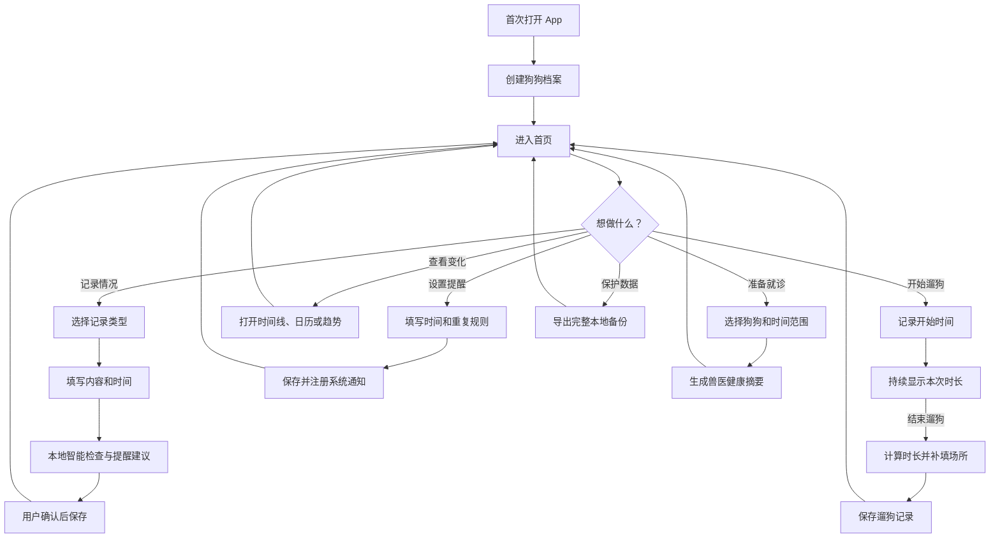
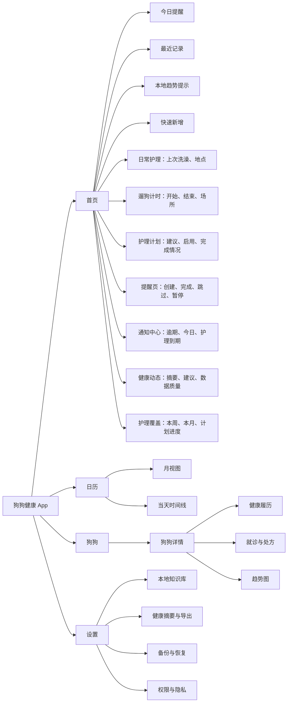
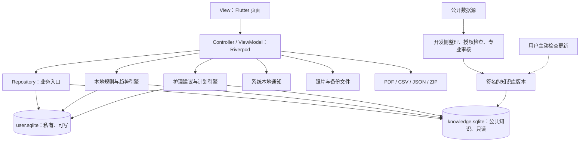
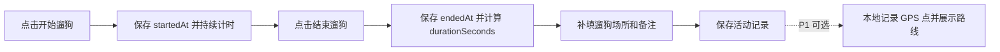
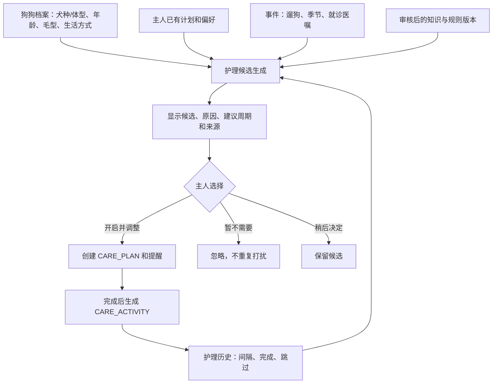
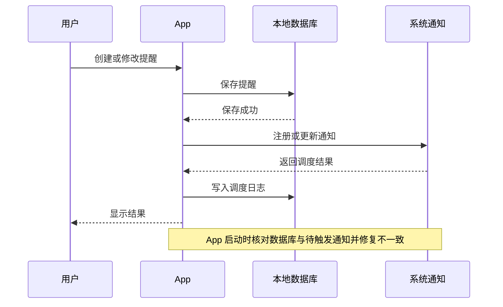
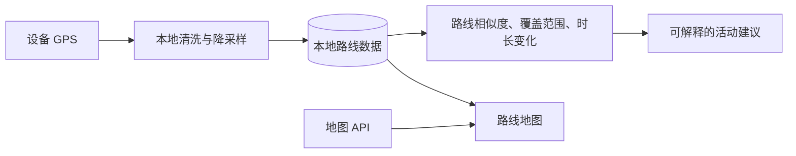
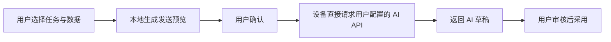
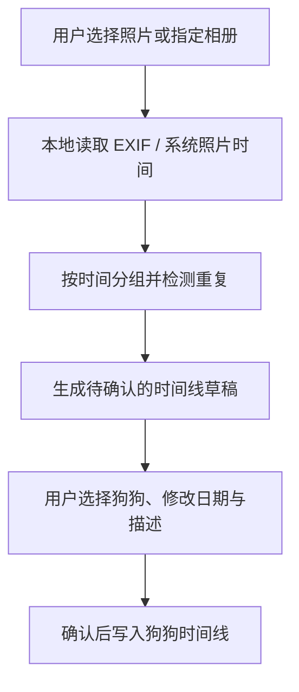

# 毛健康：狗狗健康与护理 App 项目蓝图

> 版本：0.9
> 更新日期：2026-06-27
> 状态：方向确认，随开发迭代维护

这份文件是我们共同维护的产品与技术地图。它描述软件要解决的问题、功能范围、数据结构、智能能力和开发顺序。讨论确认后的决定统一更新在这里。

## 0. 当前实现快照

截至 2026-06-27，App 已完成 P0 的记录、护理计划、提醒与轻量知识库主闭环：狗狗档案、当前狗狗切换、健康记录（饮食和饮水已拆分）、护理记录（梳毛和美容已拆分）、洗澡、遛狗计时、日历回看、历史记录编辑删除、狗狗头像、护理计划、护理覆盖统计、提醒列表、通知中心和本地 SQLite 参考手册都已接入本地 Repository。照片选择后支持原生裁切（3:4 竖屏比例）。

系统本地通知已接入，提醒可调度、暂停、完成、跳过并写入日志；护理计划到期可触发通知。iOS 已增加遛狗实时活动，Android 和其他平台继续使用进行中通知作为兜底。首页和健康动态页已接入本地健康建议、近 30/60/90 天摘要、护理覆盖率和数据质量提示。

仍处于设计或数据接口阶段的能力包括：就诊和处方、通用附件、兽医导出、完整备份恢复、OCR 和 GPS 路线。当前推进原则是：先把已上线的记录、提醒、护理计划、健康动态和本地知识库打磨稳定，再补就诊/导出/备份这些数据闭环；知识库 FTS/知识包替换、OCR 和路线能力后置。

## 1. 产品定位

产品定位为：**狗狗健康与护理履历 + 高可靠提醒 + 本地智能辅助 + 兽医协作导出**。

它完成的闭环是：

```text
观察 → 记录 → 提醒 → 趋势提示 → 回顾 → 整理就诊资料
```

产品帮助主人持续记录、按时处理事项并看懂变化，但不代替兽医诊断或开具治疗方案。

### 核心目标

- 建立一只或多只狗狗的长期健康档案
- 将洗澡、口腔、梳毛、指甲、耳眼和足爪等护理作为与健康记录并列的一等数据
- 记录体重、饮食、饮水、排泄、症状、用药、疫苗、驱虫和就诊信息
- 根据狗狗档案、护理历史和生活事件提出可解释的护理计划候选，由主人选择开启
- 设置单次或重复提醒，并追踪完成、跳过和失败情况
- 在设备本地发现值得关注的趋势，给出可解释提示
- 生成兽医容易阅读的健康摘要
- 完整导出和恢复数据，包括照片附件

### 优先服务的人群

1. 新手主人：容易遗漏疫苗、驱虫、绝育和体检计划。
2. 慢病或术后狗狗主人：需要连续记录体重、食欲、饮水、排泄、用药和复诊。
3. 多狗家庭：需要快速区分每只狗狗的记录与提醒。

### 第一版不做

- AI 自动诊断或疾病概率预测
- 自动计算、推荐或修改处方药剂量
- 把用户健康记录上传到第三方数据库
- 未经专业审核的急症判断和疾病知识

## 2. 用户使用流程



## 3. 页面与功能地图



底部导航暂定为：`首页｜日历｜狗狗｜设置`。新增记录使用全局“＋”按钮。

## 4. 总体软件架构

采用 Flutter、Material 3 和功能模块化 MVVM。用户数据与公共知识数据分开保存。



### 两个数据库的边界

| 数据库 | 内容 | 特性 |
|---|---|---|
| `user.sqlite` | 狗狗档案、健康记录、护理与活动、就诊、处方原文、提醒、提醒日志 | 私有、可写、可备份、可彻底删除 |
| `knowledge.sqlite` | 观察、记录、护理和就医准备参考手册、来源链接、知识版本 | 独立本地库、只读使用、后续可替换 |

知识库不能覆盖用户录入的兽医医嘱，也不参与 AI 问答、诊断、处方或剂量建议。完整备份只包含用户数据和附件，不需要重复打包公共知识库。

## 5. 本地智能功能

首版智能能力优先采用确定性规则、统计和模板，不依赖大语言模型。

| 能力 | 实现方式 | 阶段 |
|---|---|---|
| 智能提醒建议 | 根据记录类型、已有计划和用户历史提出提醒，由用户确认 | P0 |
| 趋势提示 | 与狗狗自身历史基线比较，提示持续或明显变化 | P0，已接入健康动态页，继续补图表和持久化 |
| 自动健康摘要 | 模板整理近期记录、体重、饮食、症状和护理覆盖情况 | P0，已接入本地摘要卡片 |
| 护理计划建议 | 根据犬种/体型、毛发、年龄、生活方式、护理历史和事件提出候选计划，由主人确认开启 | P0 |
| 护理趋势上下文 | 将护理记录作为趋势解释的上下文，不把未完成护理直接解释为疾病风险 | P1 |
| 本地知识搜索 | 轻量分类/关键词搜索已接入；FTS5 和知识包替换后续补充 | P0/P1 |
| 处方与检查单 OCR | 端侧识别文字，用户逐项确认后入库 | P1 |
| 审核后的红旗卡片 | 只给行动级别和就医准备，不给疾病概率 | P1 |
| 本地自然语言查询 | 在自己的记录中查询和汇总，不回答诊断问题 | P2 |
| 图片疾病诊断 | 风险高且难验证 | 不实现 |

### 趋势提示原则

- 优先比较同一只狗狗自己的历史，而不是套用通用正常值。
- 数据不足时只提示继续记录，不生成结论。
- 明确说明触发原因、使用了哪些记录以及时间范围。
- 阈值必须可配置、可测试，并经过专业审核后才能用于健康行动提示。
- 用户可以忽略提示或标记记录有误。
- 健康与护理数据可以联合展示和回顾，但算法不能仅凭护理频率推断疾病因果关系。

### OCR 流程


OCR 只减少输入工作量，识别结果不能未经确认直接创建用药提醒。

## 6. 可解释规则引擎

规则输出固定为提示和行动建议，不输出诊断名称或疾病概率。

```text
Rule
├── id / version / status
├── 适用犬种/体型、年龄和条件
├── 必需输入字段
├── all / any 条件组合
├── 提示等级：info / attention / urgent
├── 展示文本和触发原因
├── 建议行动
├── evidenceIds
├── reviewedBy / reviewedAt
└── expiresAt
```

规则能力分阶段实现：

| 层级 | 示例 | 计划 |
|---|---|---|
| 时间驱动 | 用药、疫苗、驱虫、复诊到期 | P0 |
| 事件驱动 | 新增就诊后建议创建复诊提醒 | P0 |
| 趋势驱动 | 一段时间内体重或食欲偏离自身基线 | P0，先做低风险提示 |
| 红旗规则 | 确定性症状组合对应就医行动 | P1，必须专业审核 |
| 风险评分 | 综合症状、病史、年龄和趋势 | 暂不实现 |

每次规则结果保存 `ruleId + ruleVersion + inputSnapshot + occurredAt`，方便解释、测试和追溯。

## 7. 公开数据源策略

公开数据不能未经整理直接成为医疗判断依据。标准流程是：

```text
下载 → 校验授权 → 保留原始快照 → 结构化 → 去重/翻译 → 专业审核 → 测试 → 发布知识包
```

| 数据源 | 可辅助的内容 | 重要限制 |
|---|---|---|
| [FDA Green Book](https://www.fda.gov/animal-veterinary/products/approved-animal-drug-products-green-book) | 美国获批动物药品的商品名、活性成分和申请信息 | 代表美国监管状态，不能代替中国批准信息或兽医医嘱 |
| [DailyMed](https://dailymed.nlm.nih.gov/dailymed/) | 人用与动物用药品标签、成分、警告和不良反应原文 | 不是所有受监管产品的完整清单；标签需区分适用动物和地区 |
| [openFDA 动物不良事件](https://open.fda.gov/apis/animalandveterinary/event/) | 公开不良事件报告的检索与研究 | 存在延迟、缺失和报告偏差；官方明确不应据此作医疗决策 |
| [openFDA 食品召回](https://open.fda.gov/apis/food/enforcement/) | 美国食品及部分犬只相关食品召回信息 | 不是犬粮专库，不覆盖中国市场，需要分类和人工校验 |
| 兽医协会、大学兽医中心资料 | 疾病观察、护理和就医指引的审核依据 | 多数不是结构化 API，复制、翻译和再发布前必须确认授权 |

国内兽药网站在没有确认稳定、正式的公开 API 和再使用许可前，不采用网页抓取。可以先维护少量人工审核的国内药品同义词和来源链接。

### 严格离线与可选联网

推荐先实现严格离线模式：公开资料由开发侧整理进 `knowledge.sqlite`，随 App 版本发布。

以后如果增加联网，只提供用户主动触发的知识包更新：

- 不上传狗狗档案和健康记录。
- 下载经过审核和签名的完整知识包，不让客户端直接拼接原始 API 结论。
- 显示知识版本、适用地区、更新时间和变更说明。
- 下载失败不影响任何记录、提醒和搜索功能。

## 8. 核心数据关系

```mermaid
erDiagram
    PET ||--o{ HEALTH_RECORD : "拥有"
    PET ||--o{ REMINDER : "拥有"
    PET ||--o{ VISIT : "就诊"
    PET ||--o{ CARE_ACTIVITY : "护理与活动"
    PET ||--o{ CARE_PLAN : "护理计划"
    VISIT ||--o{ PRESCRIPTION : "包含"
    HEALTH_RECORD ||--o{ ATTACHMENT : "包含"
    VISIT ||--o{ ATTACHMENT : "包含"
    REMINDER ||--o{ REMINDER_LOG : "产生"

    PET {
        string id PK
        string name
        string species
        string breed
        string sex
        date birthday
        bool neutered
        string allergies
        string chronicConditions
        string avatarPath
    }

    HEALTH_RECORD {
        string id PK
        string petId FK
        string type
        datetime occurredAt
        string title
        string note
        double numericValue
        string unit
        int severity
    }

    CARE_ACTIVITY {
        string id PK
        string petId FK
        string type
        datetime occurredAt
        datetime startedAt
        datetime endedAt
        int durationSeconds
        string place
        string note
        string routeFilePath
    }

    CARE_PLAN {
        string id PK
        string petId FK
        string careType
        string source
        string scheduleRule
        datetime nextDueAt
        bool enabled
        string reasonSnapshot
        string ruleId
        string ruleVersion
        datetime createdAt
        datetime updatedAt
    }

    VISIT {
        string id PK
        string petId FK
        datetime visitedAt
        string clinicName
        string complaint
        string diagnosisText
        string followupPlan
        datetime nextVisitAt
    }

    PRESCRIPTION {
        string id PK
        string visitId FK
        string drugName
        string strength
        string doseText
        string route
        string frequency
        string duration
    }

    REMINDER {
        string id PK
        string petId FK
        string sourceType
        string sourceId
        string title
        datetime scheduledAt
        string repeatRule
        int notificationId
        string completionMode
        string completionTarget
        string recordType
        string careType
        string recordDetailsJson
        string careDetailsJson
        bool enabled
        bool paused
    }

    REMINDER_LOG {
        string id PK
        string reminderId FK
        datetime occurredAt
        string action
        string result
    }

    ATTACHMENT {
        string id PK
        string ownerType
        string ownerId
        string filePath
        string mediaType
        datetime createdAt
    }
```



照片本体保存在 App 文件目录，数据库只保存路径。处方字段保存实际医嘱，不由 App 自动推算。

### 知识库核心表

| 表 | 用途 |
|---|---|
| `knowledge_articles` | 标题、分类、摘要、正文、风险等级、场景关联、标签、红旗提示和建议记录项 |
| `knowledge_sources` | 来源标题、机构、URL、访问日期和许可说明 |
| `knowledge_article_sources` | 文章与来源之间的对应关系 |
| `knowledge_versions` | 知识包版本、地区、发布时间和说明 |

## 9. 第一版记录类型

| 类型 | 建议填写内容 | 是否可以设置提醒 |
|---|---|---|
| 体重 | 数值、单位、备注 | 否 |
| 饮食 | 食物、份量、评分、备注 | 可选 |
| 饮水 | 水量、次数、备注 | 可选 |
| 排尿/排便 | 状态、次数、备注、照片 | 否 |
| 症状 | 症状、严重程度、持续时间、备注、照片 | 可选 |
| 用药 | 药名、剂型、医嘱原文、给药方式、完成情况 | 是 |
| 疫苗 | 疫苗名称、接种日期、医院、批号、不良反应 | 是 |
| 驱虫 | 药品、体内/体外、规格、给药日期 | 是 |
| 就诊/复诊 | 医院、主诉、检查、诊断原文、复诊计划 | 是 |
| 洗澡护理 | 洗澡时间、洗澡地点、护理项目、备注；首页显示距上次洗澡天数与地点 | 可选 |
| 遛狗 | 一键开始与结束、自动计算时长、结束后补填场所、备注 | 否 |
| 自定义 | 标题、内容 | 可选 |

### 遛狗记录流程、实时活动与 GPS 边界



- P0 不申请定位权限；遛狗场所由用户在结束后填写。
- 计时时长以 `endedAt - startedAt` 计算，界面计时器只负责展示，避免 App 暂停造成误差。
- iOS 支持 Live Activity 展示进行中的遛狗，并可从实时活动触发结束流程；Android 和其他平台使用进行中通知作为兜底。
- Live Activity 和通知只是展示与入口，数据库中的进行中遛狗记录仍是唯一真实来源。
- P1 可增加用户主动开启的 GPS 路线。路线点默认保存在本地，结束后立即停止定位。
- 如果地图底图依赖联网服务，必须单独说明地图提供方、网络请求和隐私影响；无底图时仍可展示本地路线折线与距离。
- 首版不根据路线或运动时长给出医疗结论。

## 9.1 护理作为一等数据

护理记录与健康记录共享同一只狗狗、时间线、日历、提醒、摘要、备份和导出能力。两者在界面上可以统一回顾，但在数据结构和算法解释中保留类型边界。

### 常见护理计划候选

| 护理类型 | 建议方式 | 重要边界 |
|---|---|---|
| 口腔家庭护理 | 对狗狗提供候选计划；主人选择是否开启及执行方式 | 使用犬用护理用品；异常、疼痛或牙龈炎症应咨询兽医，家庭护理不能替代专业检查 |
| 梳毛 | 根据犬种/体型、毛长、毛型、季节和既往打结情况提出频率候选 | 不使用所有狗狗通用的固定频率 |
| 洗澡 | 优先根据生活方式、皮肤情况、兽医建议和狗狗自身历史间隔提出候选 | 不把“越勤越好”作为规则，不对皮肤问题自行给出洗护治疗方案 |
| 指甲检查/修剪 | 建议定期检查；修剪频率由磨损速度和历史间隔决定 | 主人不熟悉或狗狗抗拒时建议由专业人员处理 |
| 耳部观察 | 提醒观察气味、分泌物、红肿和抓挠等事实 | 不默认建议频繁深度清洁，不根据观察结果自动诊断耳病 |
| 眼部与泪痕护理 | 根据品种特征、既往记录和兽医建议提供可选计划 | 只记录和温和清洁；异常分泌物、疼痛等进入健康记录和就医准备流程 |
| 足爪检查/清洁 | 遛狗结束、雨雪天气或户外活动后提供事件驱动建议 | 由主人确认完成，不自动推断皮肤或关节问题 |
| 修毛/专业美容 | 根据毛型、季节和主人历史间隔提出计划 | 不把美容频率作为健康结论 |
| 用品与环境清洁 | 食盆、水具、狗窝、牵引用品等可选家庭计划 | 与狗狗身体护理分开标记，避免混入医疗记录 |

肛门腺处理、异常耳道清洁、皮肤治疗性洗浴等不作为默认家庭护理建议；只有在兽医明确指导或主人主动建立计划时记录。

### 护理建议算法



建议来源分为四类：

1. **档案驱动**：根据犬种/体型、毛型、年龄、生活方式和兽医备注筛选适用护理。
2. **历史驱动**：数据足够后，使用狗狗自己的历史间隔生成下一次候选，不套用统一周期。
3. **事件驱动**：例如结束遛狗后询问是否记录足爪检查；新增专业美容后询问是否建立下次计划。
4. **专业计划驱动**：兽医或专业美容师给出的计划由主人原文录入，优先级高于 App 基础建议。

### 护理算法约束

- 所有护理计划默认关闭，必须由主人明确开启。
- 开启前展示适用原因、使用了哪些档案或历史数据、建议周期、规则版本和可调整选项。
- 主人可以修改周期、暂停、跳过、关闭或选择“不再建议此项目”。
- 不生成单一“护理分”或用连续打卡制造负罪感；展示事实、完成情况和历史趋势即可。
- 护理记录可作为健康趋势的解释上下文，例如同一时间线上展示皮肤观察与洗澡记录，但不得自动宣称因果关系。
- 专业医嘱覆盖基础护理规则；涉及疼痛、异常分泌物、创口、持续瘙痒等情况时转为健康记录和就医准备提示。
- 每次建议保存 `ruleId + ruleVersion + inputSnapshot + reason + userDecision`，便于解释和回归测试。

## 10. 提醒可靠性

数据库中的提醒是唯一真实来源，系统通知只是执行方式。



当前实现边界：

- `NotificationService` 在非 Web 平台初始化本地通知、申请权限并调度提醒。
- 普通提醒、护理计划到期和进行中遛狗使用独立通知 ID，避免互相覆盖。
- Web 调试端跳过系统通知，仍可保存提醒和查看提醒列表。
- iOS Live Activity 是最佳努力能力；插件不可用或启动失败时回退到普通遛狗通知。

验收要求：

- 修改、禁用或删除提醒后，旧通知不会继续触发。
- 手机重启、App 升级及时区变化后能够恢复正确计划。
- 通知权限被拒绝时，记录仍能保存，并说明如何恢复权限。
- 完成、跳过、稍后提醒和调度失败能够在日志中区分。
- 提醒失败不能影响健康记录本身的保存。

## 11. 技术选择与目录

| 领域 | 暂定方案 |
|---|---|
| 双端框架 | Flutter |
| 视觉系统 | Material 3 |
| 状态管理与依赖注入 | Riverpod |
| 路由 | go_router |
| 用户数据库 | Drift + SQLite |
| 知识库搜索 | SQLite 简单匹配；FTS5 后续增强 |
| 本地提醒 | flutter_local_notifications；Web 调试端不调度系统通知 |
| 时区 | timezone + flutter_timezone |
| 图片与文件 | image_cropper + file_selector + path_provider |
| 遛狗基础记录 | Riverpod 计时状态 + Drift 活动记录 + iOS Live Activity / 系统通知；不需要定位权限 |
| GPS 路线（P1） | geolocator 采集本地点位；地图与底图方案上线前单独评估隐私和离线能力 |
| 护理建议与计划 | 版本化本地规则 + 用户确认 + CARE_PLAN；所有候选默认关闭 |
| 端侧 OCR | ML Kit Text Recognition，经 Flutter 平台封装 |
| 自定义端侧模型 | 暂不使用；以后按验证结果评估 LiteRT |
| 健康摘要 | 本地生成 PDF |
| 完整备份 | JSON 清单 + 附件，打包为 ZIP |

```text
lib/
├── app/                    # App、路由、主题
├── core/
│   ├── database/           # user.sqlite
│   ├── knowledge/          # knowledge.sqlite、搜索和版本
│   ├── intelligence/       # 规则、趋势、解释结果（后续可独立）
│   ├── notifications/
│   ├── files/
│   ├── export/
│   └── widgets/
├── features/
│   ├── home/
│   ├── pets/
│   ├── records/
│   ├── care/               # 洗澡护理、遛狗计时与活动记录
│   ├── care_plans/         # 护理候选、启用计划、完成与跳过
│   ├── reminders/
│   ├── visits/
│   ├── calendar/
│   ├── health_tips/        # 本地健康动态、摘要和建议
│   ├── reports/
│   └── settings/
└── main.dart

tools/
└── knowledge_pipeline/     # 开发侧下载、转换、审核和打包工具
```

## 12. 功能优先级

| 优先级 | 范围 |
|---|---|
| P0 | 多狗狗档案、结构化健康与护理记录、护理计划候选及用户确认、洗澡护理、基础遛狗计时与场所、就诊与处方原文、提醒与日志、时间线、日历、照片、本地搜索、低风险趋势提示、自动摘要、完整备份恢复 |
| P1 | 可选 GPS 遛狗路线、OCR、狗狗时光机基础导入、体重等趋势图、慢病/术后模板、专业审核的红旗卡片、签名知识包更新、应用锁和加密备份 |
| P2 | 地图路线回顾与重复度分析、用户自备 AI API、本地自然语言查询、家庭共享、硬件接入和经过验证的复杂规则 |

首版验收重点是：记录结构清楚、提醒可靠、提示可解释、导出可读、备份可恢复。

## 13. 开发阶段

### 阶段 1：可运行骨架

- [x] 创建 Flutter 工程和 Material 3 主题
- [x] 配置 Riverpod、路由和四个底部页面
- [x] 建立 `user.sqlite`、迁移机制和测试数据库
- [x] 建立轻量 `knowledge.sqlite`、版本表和 Repository 接口

### 阶段 2：狗狗、记录与就诊

- [x] 完成狗狗档案、健康记录和狗狗照片
- [x] 完成洗澡时间/地点记录与“距上次洗澡”摘要
- [x] 完成遛狗开始、计时、结束、场所补填和活动历史
- [x] 完成护理记录统一时间线、筛选、日历和狗狗详情入口
- [ ] 完成就诊、处方原文和复诊计划
- [x] 完成首页、时间线和筛选

### 阶段 3：高可靠提醒

- [x] 创建单次与重复提醒
- [x] 实现完成、跳过、暂停、修改和删除
- [x] 写入提醒日志并调度系统本地通知
- [ ] 完成启动时一致性修复和更多权限/时区恢复测试

### 阶段 4：第一批本地智能

- [x] 实现提醒建议和用户确认流程
- [x] 实现基于自身历史的低风险趋势提示
- [x] 实现模板化健康摘要
- [ ] 建立 FTS5 本地知识搜索
- [x] 建立基础规则解释和单元测试
- [x] 根据狗狗档案和历史生成护理候选，并实现主人开启、调整、忽略和关闭流程
- [x] 将护理数据作为健康趋势的可解释上下文，不生成未经验证的因果结论

### 阶段 5：知识库与导出

- [ ] 建立开发侧知识整理流水线
- [ ] 完成来源、授权、审核和知识版本记录
- [ ] 生成兽医 PDF 摘要和 CSV/JSON 导出
- [ ] 完成包含附件的 ZIP 备份与完整恢复

### 阶段 6：增强与发布

- [ ] 实现 OCR，并要求用户确认所有候选字段
- [ ] 评估并实现用户主动开启的 GPS 遛狗路线、权限提示和本地路线数据
- [ ] 完成单元、组件、集成和双端真机测试
- [ ] 检查无障碍、深色模式、权限和隐私说明
- [ ] 准备 App Store 与 Android 发布材料

## 14. 医疗、智能与隐私边界

1. App 记录事实和医嘱，不自行诊断疾病。
2. 不自动计算剂量，不给出补服、停药或换药方案。
3. 智能输出必须显示原因、使用的数据、规则版本和建议行动。
4. 医疗知识必须记录来源、许可、审核人、版本和更新时间。
5. 原始公开数据不能直接变成用户行动建议。
6. 用户数据默认完全离线，不引入广告和非必要分析 SDK。
7. 只申请通知、相机、相册和文件等当前功能必需权限；GPS 路线上线前不申请定位权限。
8. 用户能够导出全部数据，也能删除单条记录、单只狗狗或全部数据。
9. 知识包更新不得上传狗狗档案或健康记录。
10. 所有规则和数据库结构变更必须有迁移与回归测试。
11. 护理建议默认关闭；不得在主人未确认时自动创建计划或通知。
12. 护理完成率不能被包装成健康评分，也不能单独触发疾病或风险结论。

## 15. 未来能力设想

以下功能进入未来路线图，但不进入首版范围。实施前需要单独完成权限、隐私、成本和技术选型。

### 15.1 GPS、地图与路线丰富度

目标：记录散步路线，在地图中回顾活动；积累足够数据后，在本地计算路线重复程度、地点覆盖和活动变化，并生成丰富散步体验的建议。



建议分三步：

1. GPS 散步记录：开始、暂停、继续和结束，保存轨迹、距离与时长。
2. 地图展示：接入地图 API，查看单次路线与历史路线重叠。
3. 智能分析：先用本地算法计算指标，再按需使用 AI 生成非医疗性的自然语言建议。

“狗狗乏味度”不是确定事实或医学指标。界面应使用“路线丰富度”“路线重复程度”或“活动变化”，并说明这是基于有限轨迹的体验建议。

隐私要求：

- 只在用户主动开始散步后记录位置，不默认持续后台追踪。
- 明确显示定位状态，并提供暂停、删除与导出能力。
- 支持隐藏家庭附近的起止点；原始 GPS 轨迹默认不发送给 AI。
- 地图服务可能接收坐标，接入前必须说明服务商和数据用途。

预留模型：`WalkSession(id, petId, startedAt, endedAt, routePoints, distance, mapProvider, routeSimilarityScore, userNote)`。

### 15.2 用户自备 AI API

目标：软件不设服务器。用户自行填写第三方 AI 服务的 API 地址、API Key 和模型名称，由设备直接联网请求。



适合用途：

- 整理近期记录的自然语言摘要
- 查询和汇总自己的狗狗记录
- 根据已计算的路线指标生成活动建议
- 辅助整理照片描述和时间线文案

实现边界：

- API Key 存入 iOS Keychain / Android Keystore，不写入普通数据库、日志或备份。
- 只允许 HTTPS，支持连接测试、清除密钥和完全关闭 AI。
- 调用前展示将发送的字段，默认去标识化并最小化数据。
- 不默认发送全部记录、照片或 GPS 原始轨迹。
- AI 输出先作为草稿；未经确认不能写入正式记录、医嘱或提醒。
- 明确提示第三方费用、隐私政策、数据保留方式和网络错误。
- 断网或关闭 AI 不影响任何核心功能。
- AI 不用于自动诊断、疾病概率、药物剂量和治疗方案。

### 15.3 狗狗时光机

目标：读取用户授权照片的拍摄时间，把狗狗历史照片整理成可以编辑的成长时间线。



规则与边界：

- 优先使用原始拍摄时间；缺失时标记“时间未知”，不猜测准确日期。
- 截图、转存和聊天软件保存的时间可能不可靠，必须允许编辑。
- 由用户确认照片属于哪只狗狗；第一版不自动识别狗狗身份。
- 初次扫描只生成草稿，不直接写入健康或护理记录。
- 照片时间读取、分组与去重优先在本地进行，不上传原图。
- 用户可以移除照片、修改日期、合并事件或只保存照片。

预留模型：`MemoryItem(id, petId, assetId, localFilePath, capturedAt, dateSource, title, note, importStatus, sourceMetadata)`。

## 16. 首版质量指标

| 领域 | 验收方式 |
|---|---|
| 离线能力 | 飞行模式下所有 P0 功能可用 |
| 提醒可靠性 | 覆盖新增、修改、删除、重启、升级、时区和权限测试矩阵 |
| 智能可解释性 | 每条提示可查看触发记录、原因和规则版本 |
| 数据不足处理 | 样本不足时不输出健康结论 |
| OCR 安全性 | 未经用户确认的识别结果不能创建记录或提醒 |
| 备份恢复 | 全新环境执行导出→清空→恢复，记录和附件一致 |
| 知识追溯 | 每条知识和规则能够追溯到来源及审核状态 |
| 双端体验 | iOS、Android 的主要流程、深色模式和大字体均可完成 |
| 遛狗计时 | App 前后台切换后仍按开始/结束时间正确计算；结束后停止所有计时与可选定位 |
| 护理建议控制权 | 每条建议可查看原因、开启、调整、忽略和永久关闭；未经确认不创建提醒 |
| 护理与健康联合回顾 | 时间线和摘要可同时呈现两类事实，并清楚标记类型且不暗示因果关系 |

## 17. 待讨论事项

- [x] App 名称确定为“毛健康”，寓意毛孩子健康。
- [x] 第一版只服务狗狗，暂不扩展到其他动物品类。
- [ ] 首页更强调今日提醒、最近状态还是趋势提示？
- [ ] 第一批趋势只做体重，还是同时加入食欲、饮水和排泄？
- [x] 首版知识库只收录症状观察、记录指南、日常护理、预防健康和就医准备。
- [ ] 谁负责审核医疗知识和红旗规则？
- [ ] 是否接受未来提供“用户主动检查知识更新”的轻量联网功能？
- [ ] 首版健康摘要只做表格，还是加入体重折线图？
- [x] 重复提醒支持每天、每月、每周 N 次、每周指定星期、每 N 天和每 N 周。
- [ ] 首版是否需要应用锁或加密备份？
- [ ] 地图服务的目标地区和候选供应商是什么？
- [ ] 用户自备 AI API 首先支持一种兼容协议，还是允许自定义请求模板？
- [ ] 狗狗时光机首版只允许手动选照片，还是允许授权指定相册？

## 18. 变更记录

| 日期 | 版本 | 内容 |
|---|---|---|
| 2026-06-27 | 0.9 | 接入并扩展轻量本地 SQLite 知识库，覆盖症状观察、记录指南、护理、预防、就医准备、生命周期、犬种差异和季节照护，并加入健康动态和护理中心的相关文章跳转 |
| 2026-06-26 | 0.8 | 同步护理计划、提醒页、通知中心、系统本地通知、iOS 遛狗 Live Activity、护理覆盖统计、本地健康动态和健康摘要的实现状态 |
| 2026-06-24 | 0.7 | 饮食/饮水拆分为独立类型，梳毛/美容拆分为独立类型，狗狗列表移除类型筛选，档案类型改为下拉选择，新增图片裁切功能 |
| 2026-06-22 | 0.5 | 加入 GPS 与地图路线丰富度、用户自备 AI API、狗狗时光机及对应隐私和实施边界 |
| 2026-06-22 | 0.4 | 将护理提升为一等数据，增加护理计划、候选建议算法、用户确认机制及与健康趋势联合回顾的边界 |
| 2026-06-22 | 0.3 | 整合本地智能、双数据库、规则引擎、公开数据源、OCR、知识流水线和安全边界 |
| 2026-06-22 | 0.2 | 强化产品定位、就诊/处方模型、提醒日志、兽医摘要和质量指标 |
| 2026-06-21 | 0.1 | 创建产品目标、页面、架构、数据关系和开发阶段初稿 |
